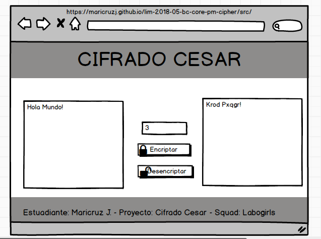
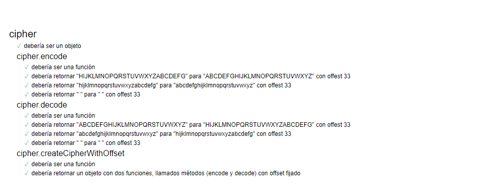
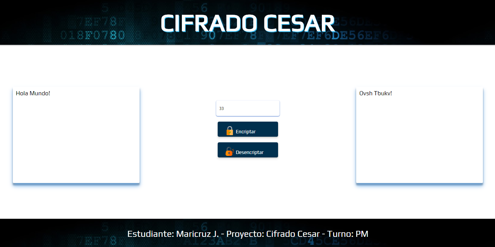
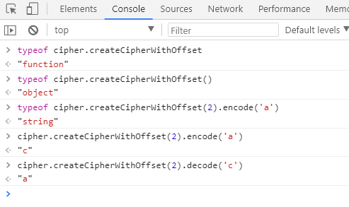

# PROYECTO 1 - CIFRADO CESAR

## Principales Usuarios:

Esta aplicación va dirigido a quienes necesiten usar una aplicación de mensajería cifrada,
donde para ver el texto original se tiene que tener si o si una llave (en este caso un número de 0 - 152).
El problema más cercano a resolver, según los requerimientos es la coordinación de una fiesta sorpresa. Pero se espera
que esta aplicación pueda ser una app de mensajería, para ello en base a los feedback e investigación darle mayor funcionalidad.

## Inicio del Proyecto:

Tomando como punto de partida los requerimientos definidos por el equipo de Laboratoria, 
en coordinación con el squad se definió el Product Backlog del proyecto, y las actividades a realizar
durante las próximas 2 semanas.

Se contó con el apoyo del coach del squad (Daily Meeting, feedback), de los demás integrantes del equipo de laboratoria
y sobre todo de los integrantes del squad. Con el paso de los días se logró también definir el trabajo en equipo y sus límites,
ya que el proyecto se presentaría de forma individual.

> El día 1 una vez definido el Product Backlog, inicié con el diseño de la página (parte UX), para ello de entre las herramientas
> para prototipado elegí balsamiq.

## Semana 1:

Se logró al objetivo: 

> * HTML	: Estructurar la página en base al prototipo.
> * CSS		: Añadirle estilos a la pagina.
> * JavaScript	: 
>		- Eventos del DOM.
>	   	- Cifrado y Descifrado solo de mayúsculas.
> * DEMO	: Revisión del avance del proyecto 1.

## Semana 2:

Considerando que el usuario no necesariamente escriba en mayúsculas, entonces comencé a modificar la parte de JavaScript,
pasando de solo cifrar o descifrar mayúsculas, también tome en cuenta las minúsculas o ambas. Asimismo se tomó en cuenta
los espacios, números y demás signos mostrándolo de la misma forma que se ingresó, debido a que según la historia, Julio
Cesar usaba este tipo de cifrado alfabético para comunicarse con sus generales. 

> Se editó el archivo para el Test, logrando un 100%.

> Tomando en cuenta los feedback, decidí modificar el css para darle más estilo a la web.

> En base a la rúbrica de evaluación, instalé ESlint y JShint en Visual Studio Code, 
> renombré las variables, haciendo uso del camelcase, ingles, identación, entre otros.

> En la caja de texto para el ingreso del offset (llave), se limitó a que el usuario ingrese solo números.

Finalmente se tiene la aplicación web para cifrar y descifrar texto.

## HACKER EDITION:

Para realizar esta parte tuve que volver a leer teoría y definir 

> * Una función
> * Un objeto
> * Un método

Finalmente usé el modo consola de la web usando el typeof.

## README:

Usando https://joedicastro.com/pages/markdown.html como guía, realizé este readme.

